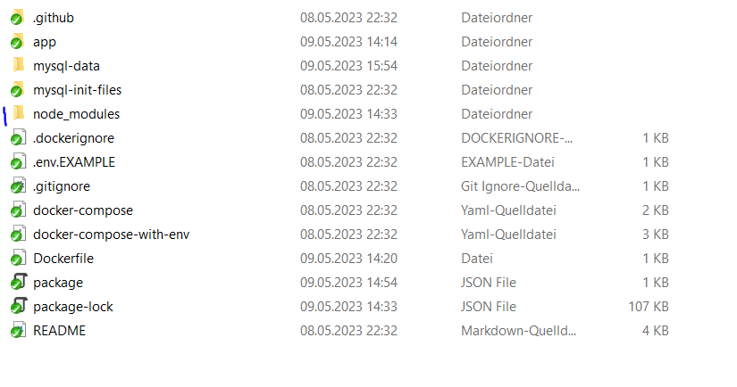

# ReST Web Service Example Light for Docker Compose Exercise

> For this exercise, we provide a base [node](https://nodejs.org/en/)/[express](https://expressjs.com/) application, which should be used for CI/CD Pipeline.

## Prerequisites
* [Node.js](https://nodejs.org/en/)
  * we recommend current [LTS](https://nodejs.org/dist/latest-v14.x/)


## First Steps
install current dependencies
```console
npm install
```

> What comes with this project?
> * [express](https://expressjs.com/), fast web framework to create web-services
>   ```console
>   npm install --save express
>   ```
> * [dotenv](https://www.npmjs.com/package/dotenv) to load custom environment variables from [`.env`](.env.EXAMPLE) file
>   ```console
>   npm install --save dotenv
>   ```
> * [mysql2](https://www.npmjs.com/package/mysql2), module to work with MySQL database for persistence
>   ```console
>   npm install --save mysql2
>   ```
> * [mocha](https://www.npmjs.com/package/mocha), JavaScript test framework for Node
>   ```console
>   npm install mocha --save-dev
>   ```
> * [chai](https://www.npmjs.com/package/chai), assertion library, similar to Node's built-in assert. It makes testing much easier by giving you lots of assertions you can run against your code
>   ```console
>   npm install chai --save-dev
>   ```

> ### Project structure
> * [`.env.EXAMPLE`](.env.EXAMPLE): example for `.env`. create a copy to set custom configurations
> * [`package.json`](package.json): node configuration/dependencies/devDependencies file
> * [`server.js`](server.js): start point for our web-service. setups express and starts listener.
> * [`util`](util): directory for utility files
>   * [`config.js`](util/config.js): setup configurations, read/set environment variables (e.g. port)
> * [`greetings`](greetings): directory for our 'greetings' resource
>   * [`controller.js`](greetings/controller.js): "business" logic to handle different HTTP calls on 'greetings' resource.
>   * [`index.js`](greetings/index.js): routing configuration for 'greetings' resource
>   * [`model.js`](greetings/model.js): db handler for 'greetings' resource
> * [`test`](test): test cases
>   * [`greetings.js`](test/greetings.js): simple chai test for testing Node REST API

Important for Dockerfile and Image Creation, there we only need node dependencies without testing / development devependencies

```
  RUN npm ci --silent --only=production
```


start application server
```bashvb 
node server.js
## or
npm start
```

test application server
```bashvb 
npm test
```

## Quick Overview about REST Structure Light

depending on the REST example of notes management, we will take a quick look at important relations between REST, HTTP and SQL.

| 	URL		      | 	HTTP Verb	  |   	CRUD 	    |	SQL   		| 	comment 	   		           | Redis Caching |
|-------------|--------------|---------------|-----------|---------------------------|-------------------|
| /greetings      | GET 			    | 	READ		    |	SELECT  	| read **all** greetings  	 | Yes |
| /greetings/1    | GET 			    | 	READ		    |	SELECT  	| read **one** greeting 	   | not implemented |

check it out with your browser, [cURL](https://curl.se/) or [Postman](https://www.postman.com/) for example.

use [Postman Collection](https://www.postman.com/collections/68249abda8f8d5ec3f15) for quick start and to do first API calls


## References
* [Node.js - Das umfassende Handbuch](https://www.rheinwerk-verlag.de/nodejs-das-umfassende-handbuch/)

## Useful links
* [express framework](https://expressjs.com/)
* [SQLite](https://www.sqlite.org/docs.html)
* [HTTP Methods](https://restfulapi.net/http-methods/)
* [HTTP Status Codes](https://restfulapi.net/http-status-codes/)
* [JavaScript: arrow function vs. regular function](https://levelup.gitconnected.com/arrow-function-vs-regular-function-in-javascript-b6337fb87032)

## Authors
* Prepared by Harald Schwab, Web Service Development, Notes Example
* Prepared by Michael Ulm, Continuous Delivery


# Exerciese 3

Alle Schritte konnten Durchgeführt es gab am Anfang ein paar Probleme mit dem Setup welche sich jedoch durch online Recherche beheben lassen konnten.

Die durch docker compose erstellten container


Die Docker Images


npm Test


das nodemodul welche vorhanden sein hatt sollen

